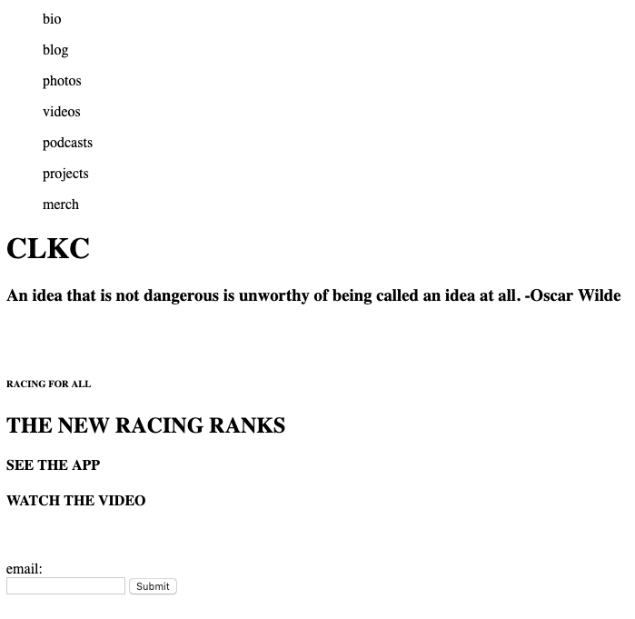
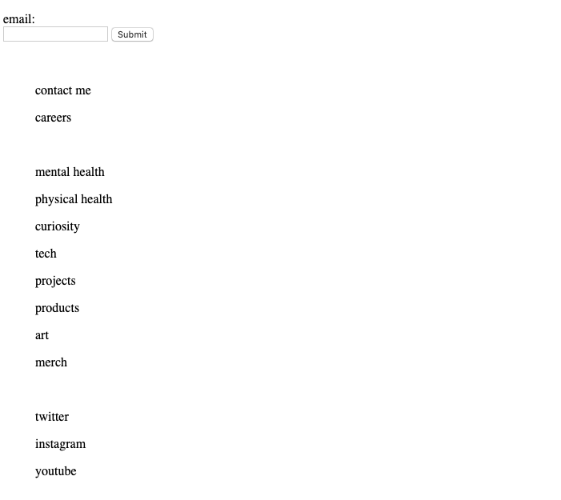

# CS52 Lab1

Craig Calhoun 4-6-19

## Landing Page Inspired by Specialized.com

I drew inspiration from Specialized.com, the website of Specialized bikes. The landing page is very simple with a header, main picture with a content, and a footer. I added a few extra pictures and some animations to spice things up. The sizing was based on a wide desktop screen and a narrow mobile size, sizes in between are sub-ideal.

##Things to note

* The menu resizes into a hamburger menu. When the hamburger menu is clicked, the menu transitions in, nicely fit next to the logo. The cursor on this menu and all other links is the pointer, not the defualt.
* The content in the middle of the page includes hover states where the buttons change color. There is also an animation of "RACING FOR ALL" racing across the screen. This content resizes for the mobile version as well.
* The footer resizes well into three blocks in a column.
	* The first block includes an email entry form with a submission button that is customized.
	* The second block includes another menu meant to sort content from the vairous content pages that can be selected from the menu in the header.
	* The third block is all about connecting with me. It has a 'contact me' link and three links that are icons. The icons are the twitter, instagram, youtube, and linkedin.

##Layout Screeshots
* 
* 

## References

* [CSS Tricks](https://css-tricks.com/the-checkbox-hack/) - checkbox hack
* [Stack Overflow](https://stackoverflow.com/questions/21338045/css-linear-animation-across-screen) - CSS animation

##Icons
* [FontAwesome](https://fontawesome.com/start ) - the hamburger menu came from google images.

##Photos
Found through google images sourced from links below (only including the ones I found after hearing this is important, everything is available to the public):

* [Car Spec Wall](https://www.carspecwall.com/porsche/911-series/911-gt3/911-gt3-rs-2015/porsche-911-gt3-rs-2015-wallpaper-002/) - Porsche
* [Lamborghini](https://www.lamborghini.com/en-en/models/huracan/huracan-performante ) - Performante
